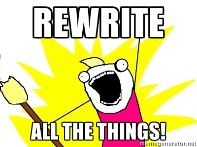
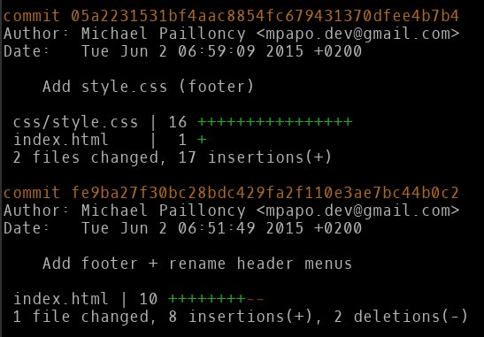

= Twiddling with the history
:source-language: console
:toc: right
:sectnums:

== Rewriting

CAUTION: For this workshop, you need to use repository `git-next-level-workshop-rewriting.git` (workshop resources).

=== Playing with rebase
==== Basics
See <<rebaseInteractiveBasics>> first and along the lab if needed.

==== Let's start

* Open your shell, `cd` to the git workshop repository, list all commits.

CAUTION: Respect the steps order of the following. If you don't, you may change commit SHA-1 and not be able to find the SHA-1 given below.

==== Easy ramp up
* The three last commits ("Add jumbotron (partXXX)") are not consistent separately, merge these commits to create only one (and remove the useless _(partXXX)_ part of the commit log).
** (For reference: first commit SHA-1 shortened version	 = `fc3034f86`)

.Correction
****
* `git rebase -i HEAD~3`
* `r` on the first
* `f` on the second and third
* Git opens the editor: amend the log and quit (without the parenthesis part)
* Watch Git squash automatically next commits
* Done
****

==== A bit harder

.Situation summary
|====
a|

Commits `fe9ba27` and `05a2231` are a mess. They contain a dump of modifications without much consistency.

* Commit `fe9ba27` contains different modifications : 
** adds a footer ;
** fixes the header added in the previous commit.
* Commit `05a2231` is a fix of commit `fe9ba27` 

Let's fix them!
|====

* Start an interactive rebase
* Edit the "Add footer + rename header menus" commit to split it in two distinct commits (hint: `git reset HEAD~1` and `add -p`):
** A first one with header
** A second one with the footer part
* Then, just merge the "Add style.css (footer)" commit into that second one you just created

TIP: you can choose to do the exercise above in one go, or do it in two successive interactive rebases.

.Correction
****
* `git rebase -i fe9ba~` to open the editor on the first commit we want to modify
* Put `edit` on the first line and `fixup`on the second one
* Git puts you on the `fe9ba27` commit
* Reset it "softly" one commit behind (too keep the code modification) : `git reset HEAD~`
* `git add -p` - then s (split) to only stage the beginning of the file (the header)
* `git commit -m "Added header"`
* `git add -p` again to stage the end of the file
* `git commit -m "Added footer"`
* `git rebase --continue`
* Done
****

==== Smoothy landing
* Commit `dbb8f26` has a spelling error. Fix it.

=== Playing with dangling commit

Execute this command : 
[source]
git checkout fe9ba27

This commit has been modified during previous actions. But you can still check it out.

* How does Git keep track of it?
* Explain why.

=== Playing with "cherry-pick"

The current repository has a branch named "header-black-experiment".
Execute : 
[source]
git checkout header-black-experiment

* List all commits.
* Using cherry-pick command, try to retrieve commit edcdd0a on the master branch
