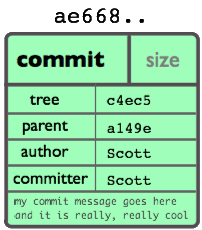
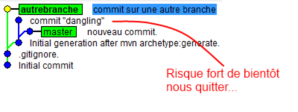
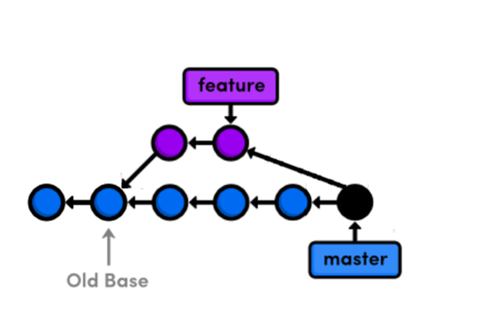

= Git - Pusher pour réussir
Baptiste Mathus <batmat@batmat.net>
:backend: deckjs
:split:
:menu:
:goto:
:deckjs_transition: fade
:deckjs_theme: swiss
:navigation:
:deckjsdir: ./.deck.js

//image::ressources/git-logo.png[Git]

== Qui suis-je ?

* Baptiste Mathus
** link:http://twitter.com/bmathus[@bmathus]
** link:http://batmat.net[http://batmat.net]

* Devops passionné
* Fan et contributeur Open Source
** Committer link:http://www.mojohaus.org/[MojoHaus] (anciennement MOJO@Codehaus)
** Plugin Jenkins link:https://wiki.jenkins-ci.org/display/JENKINS/Build+Trigger+Badge+Plugin[BuildTriggerBadge]
** Traduction communautaire du livre link:http://jenkins-le-guide-complet.github.io[Jenkins – The Definitive Guide]
* Membre de l'équipe du link:http://toulousejug.org[ToulouseJug]
* Utilisateur de Git depuis 2010

image::ressources/me.png[Me]

== Git - finalement assez simple

image::ressources/git-fake.png[]

<<<

== Un peu d'histoire, quand même.

* 1991 → 2002 : le développement de Linux utilise tarball

[quote, Linus Torvalds]
For the first 10 years of kernel maintenance, we literally used tarballs and patches, which is a much superior source control management system than CVS is – Linus Torvalds

<<<

* 2002 : Passage à BitKeeper

DVCS closed-source, licences offertes à l'OSS.

<<<

* Avril 2005 : Fin annoncée de la licence gratuite

Provoqué par un reverse-engineering du protocole BitKeeper par Andrew Tridgell

<<<
* 7 Avril 2005 : Première version de Git

[quote, Linus Torvalds]
I'm an egotistical bastard, and I name all my projects after myself. First 'Linux', now 'git'.

== Les quelques commandes de Git

image::ressources/commandes-git.png[]

== Super ! Mais en vrai, on utilise quoi ?

== Les bases

* **D**VCS
* **Dé**centralisé

* Techniquement, pas besoin de serveur
* _(Presque)_ Tout se passe donc en local
* Après un clone, *tout* l'historique du projet est en local et ne nécessite plus aucun accès réseau pour le manipuler

== Rapide, Git ?

* Performances, les origines

[quote]
[…] to make that process really efficient. If it takes half a minute to apply a patch and remember the changeset boundary […] then a series of 250 emails […] takes two hours. If one of the patches in the middle doesn't apply, things are bad bad bad.

<<<

* Orienté *contenu*
* Des snapshots, pas des diff

image::ressources/snapshots-vs-delta.png[]

// Expliquer ce que sont les hash - sha1 everywhere :)

== Les 4 types d'objets

<<<

blob:: Contenu d'un fichier identifié par un hash
image::ressources/object-blob.png[]

<<<

tree:: Liste de références vers des hashes
image::ressources/object-tree.png[]

<<<

commit:: Référence le hash d'un tree + métadonnées

<<<

tag:: Nom donné à un commit + métadonnées
image::ressources/object-tag.png[]

== Les 4 types d'objets - Récap

image::ressources/git-objects-types.png[]

== Les commits Git

* Identifié par un hash _SHA-1_
* Version courte ≥ 4 caractères possible (si non ambiguë)

`53b8` = ``53b8``9fc7bb117aee396285f9bc6ce913599a6574

<<<

* 1 à n parents

* DAG : _Directed Acyclic Graph_

image::ressources/dag-illustration.png[]

== Sondage : qui a déjà utilisé les merges avec svn ?

<<<

Un peu de concentration...

image::ressources/merge-svn.gif[Un peu de concentration]

<<<
Quand ça plante pas

image::ressources/merge-svn2.gif[]
image::ressources/merge-svn3.gif[]

== Avec Git, les merges _just_ fonctionnent

image::ressources/happy.gif[]

== Bref, les branches c'est la vie

== Les branches ?

* Simple pointeur vers un commit
* Git référence des _têtes_

<<<

* Tout commit non référencé par un nom finira supprimé (dans longtemps)
* Commit non référencé : _Dangling_ ou _detached HEAD_

* Git a aussi un Garbage Collector ! :-)

== Bon, mais comment on démarre ?

[source]
$ git config user.name "Baptiste Mathus"
$ git config user.email batmat@batmat.net
$ mkdir nouveaurepo
$ cd nouveaurepo/
$ git init
Initialized empty Git repository in nouveaurepo/.git/
$ git commit -m "Initial commit" --allow-empty
[master (root-commit) 53b89fc] Initial commit
$ touch pouet
$ git add pouet
$ git commit -m "Création du premier fichier indispensable."
[master 2ce6ac4] Création du premier fichier indispensable.
0 files changed
create mode 100644 pouet

== En détails

<<<
    git commit -m "Initial commit" --allow-empty

Conseil : *toujours* un commit racine vide

<<<

   git add

Ajout dans *l'index*

== L'index : espace de préparation du prochain commit

image::ressources/git-staging-area.png[]

* On peut _stager_ morceau par morceau ! (et c'est conseillé)

== Quiz: git add

[source]
.What content has been committed for the _theFile_ file? (1) or (2)?
----
echo "dingdingdingbabababaaaaa" >> theFile # (1)
git add theFile
echo "blah" > theFile # (2)
git commit -m "done"
----

[options="step"]
Right answer: (1)

// Because git add adds the content when called, not only the
// reference to the file like SVN does for example

== Les commandes essentielles : rebase & merge

What you want to express :

Rebase:: when you don't want your local history to be seen as side/sub-work
Merge:: it was side/sub-work

[canvas-image=ressources/git-rebase-illustration-lol.gif]
== Rebase

[role="canvas-caption", position="left-up"]
Git Rebase!

== Rebase

(on feature) git rebase master

image::ressources/rebase-before.png[]

<<<

Rewinding:

<<<

Rewinding:

image::ressources/rebase-rewind2.png[]

<<<

Replaying:

image::ressources/rebase-replayed1.png[]

<<<

Replayed:

<<<

Rebased:

== Merge

(on master) git merge feature

image::ressources/rebase-before.png[]

<<<

After (`merge commit` created):

== Concept très important : le *fast-forward*

Si possible, Git cherche à ne pas créer de _commit de merge_ même si on lui demande un _merge_

image::ressources/ff.png[Fast-forward illustration]

[source,role="console"]
$ git checkout master
$ git merge feature
Updating 38d98a8..d92c9b5
Fast-forward

== Rebase interactif : *réécrire l'histoire !*

[source,role="console"]
----
$ git rebase -i HEAD~3

pick 910f70a Message antépénultième commit
pick 0e7f74d Message avant-dernier commit
pick 77aab98 Message dernier commit

# Rebase 77f6f4a..77aab98 onto 77f6f4a
#
# Commands:
#  p, pick = use commit
#  r, reword = use commit, but edit the commit message
#  e, edit = use commit, but stop for amending
#  s, squash = use commit, but meld into previous commit
#  f, fixup = like "squash", but discard this commit's log message
#  x, exec = run command (the rest of the line) using shell
#
# These lines can be re-ordered; they are executed from top to bottom.
#
# If you remove a line here THAT COMMIT WILL BE LOST.
#
# However, if you remove everything, the rebase will be aborted.
#
# Note that empty commits are commented out
----

== Quelques autres commandes intéressantes

* git _reflog_ : un filet de sécurité qui peut vous sauver la vie

[source,role="console"]
$ git reflog
2ce6ac4 HEAD@{0}: checkout: moving from nouvellebranche to master
07df291 HEAD@{1}: checkout: moving from 07df291f4d7fc93b10f28ae25c04fff67d674f30 to nouvellebranche
07df291 HEAD@{2}: commit: Nouveau commit
53b89fc HEAD@{3}: checkout: moving from master to 53b89fc
2ce6ac4 HEAD@{4}: commit: Création du premier fichier indispensable.
53b89fc HEAD@{5}: commit (initial): Initial commit

== Bisect
=== killer-feature : recherche d'un commit problématique par dichotomie

[source,role="console"]
----
$ git bisect log
git bisect start
# good: [aa630f76c8c3e8e0ee894538e5bf262890afb862] [maven-release-plugin] prepare release jenkins-1.423
git bisect good aa630f76c8c3e8e0ee894538e5bf262890afb862
# bad: [cbb2e30deb846414c203a36c9b4fdf00c1193c25] [maven-release-plugin] prepare release jenkins-1.424
[...]
git bisect bad cbba3c88a9ce76edd47a4ab9b9e54dc9bb05e606
# bad: [1fd7fb2c11dd3cb46843d274fcd4aaf44f34213b] when tried stand-alone, I learned that those dependencies cannot be really excluded.
git bisect bad 1fd7fb2c11dd3cb46843d274fcd4aaf44f34213b
1fd7fb2c11dd3cb46843d274fcd4aaf44f34213b is the first bad commit
commit 1fd7fb2c11dd3cb46843d274fcd4aaf44f34213b
Author: Kohsuke Kawaguchi &lt;kk@kohsuke.org&gt;
Date:   Sat Jul 30 09:59:07 2011 -0700

    when tried stand-alone, I learned that those dependencies cannot be really excluded.

:040000 040000 afe7deb89dae782db89ee79e36d767f348b6f1b5 e2be3a211e5a211ad0d91fee8e32095a888d4786 M      core
----

// TODO submodules

== Les points faibles

* Courbe d'apprentissage ardue pour les cas sortant du svn-like
* Noms ou utilisation de commandes parfois déroutantes, notamment quand on vient de Svn
** git checkout = svn switch, ou revert pour un seul fichier...
** git reset --hard = svn revert -R *
** reset : pourrait nécessiter une présentation entière...
** add : résoudre un conflit, ajouter tout ou partie d'un fichier...

== Démo

image::ressources/two-thumbs-up.jpg[]

== Conclusion &amp; Conseils

* Git reste simple si on fait du svn-like
* Commit, push, pull, commit, push, et voilà...

[options="step"]
* En cas d'erreur, lisez ce qui est affiché...
* Git est complexe pour les cas plus avancés
* Avec Git, sachez où vous êtes et où vous allez !

[options="step"]
[quote,Abla Farhoud]
L'homme qui augmente sa capacité de comprendre augmente sa puissance d'agir.

== Références et liens utiles

* Page web interactive mnémotechnique
** http://ndpsoftware.com/git-cheatsheet.html

* Apprendre Git en ligne
**	http://pcottle.github.com/learnGitBranching/
** http://try.github.com/levels/1/challenges/1

* Présentations de Sébastien Douche au ParisJUG
** http://www.parleys.com/#id=2366&amp;st=5
** http://www.parleys.com/#st=5&amp;id=2368

* Présentation de David Gageot au BreizhJug
** http://www.parleys.com/#st=5&amp;id=2117&amp;sl=2

* Présentations de Scott Chacon
** https://github.com/schacon/git-presentations

* Présentation Git par Linus Torvalds chez Google
** http://www.youtube.com/watch?v=4XpnKHJAok8

* Un merci général à Internet pour certains graphes de cette présentation ;-)
