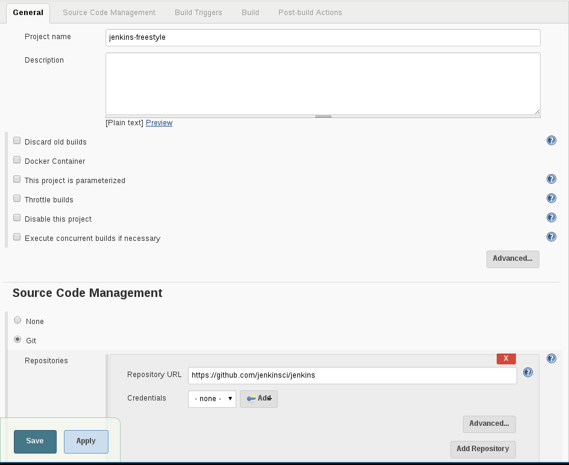
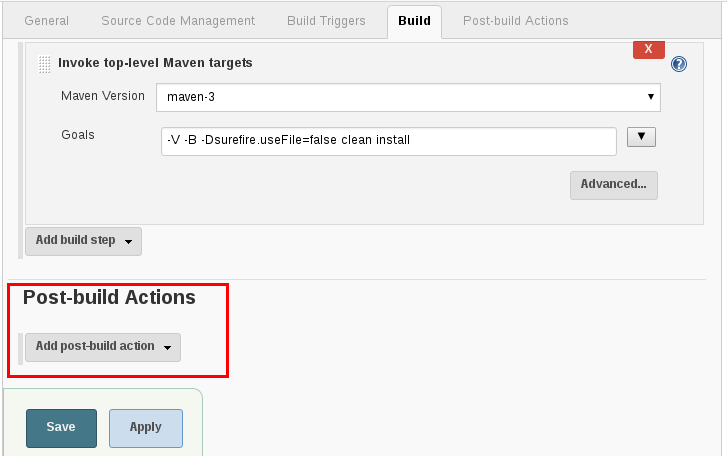
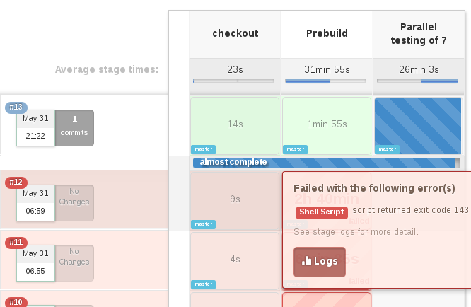
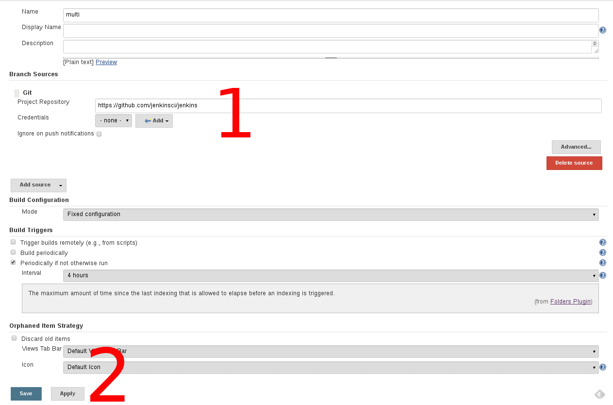
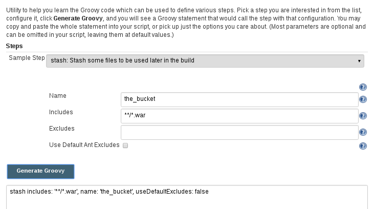

= Jenkins Pipeline As Code
Baptiste Mathus <@bmathus>
:backend: deckjs
:split:
:deckjs_transition: fade
:deckjs_theme: swiss
:navigation:
:menu:
:goto:
:status:
:deckjsdir: ../.deck.js
:source-highlighter: coderay
:coderay-css: class
:customcss: resources/custom.css
:customjs: resources/custom.js

== About Me

[source,groovy]
def BaptisteMathus =
    people.filter(p -> p.isHacker())
          .filter(p -> p.isOpenSourceFan())
          .filter(p -> p.lovesCommunities())
          .filter(p -> p.isCommitterOn("Jenkins"))
          .filter(p -> p.isCommitterOn("MojoHaus"))
          .filter(p -> p.doesRidiculousJokes())
          .uniqueResult()

image::resources/batmat-about.png[width=500]

[role="tags"]
#jenkins #java #docker #maven #automation #devops #passion

== Agenda

* Quick History Of Jenkins
* Build Jenkins!
* Build Jenkins, again! Quicker.
//* [line-through]#Build Jenkins, again, quicker, and deploy it!# _beta-effect :)_

== A bit of history

2005 : Hudson created by Kohsuke Kawaguchi

<<<

2011 : Oracle forks the project.

The community renames the project to Jenkins and goes away

<<<

2016 : Jenkins Project Still Vibrant

image::resources/jenkins-infographics.png[]

////
* 120k installations in the world
* 8 millions of jobs
* 1.2k public plugins
* 100 merged pull requests per months merged on the _core_
* 1.6k Git repositories
* users mailing list: 8k subscribers, 400 messages per month
* developers mailing list: 4k subscribers, 500 messages per month
////

==	Let's build... Jenkins

Typically. You would do:

<<<

image::resources/freestyle-2.png[]

<<<

* Deploy to test environment? User Acceptance Testing?

Or, create a bunch of jobs.

// and chain them
// Publish over ... SSH, whatever

==	Wait. What if I want to

[%step]
* Wait for user input?
* Parallelize some of the steps?
** fail-fast?
* Deploy to a testing environment
** after successful standard tests,
** but before UA Testing is finished?
** If UAT fails, rollback to previous version?
* And more...

== Pipeline: From Code To Deployed App

image::resources/pipeline-concept.png[]

////
Code goes in, (deployed) app goes out
////

== But what about maintenance?

* Versioning?
* Readability?
* Robustness?

////
		How to maintain all that?
			Versioning?
			Readability?
		What if Jenkins crashes in the middle of all that? Or just if I have to restart it?
////

== Everything As Code

image::resources/all-as-code/infra-as-code-tools.png[]

<<<

When everything is code, then versioning comes (almost) for free.

Also, rollback.

[.lead]
Go faster!

== Deliver As Fast As Possible!

[.lead]
What is a commit that is not running in production?

<<<

[.lead]
A Commit Not Yet In Production Is Stock!

== The Jenkins Pipeline Plugin(s)

* Scripted -- Domain Specific Language
* Pausable
* Extensible
* Fist public beta release: June 2014

== So, now. Let's get back to building Jenkins

[source,groovy]
----
node ('label') {

  git "https://github.com/jenkinsci/jenkins.git"

  // triggers the tool install as usual
  def java  = tool 'jdk-1.8.0'
  def maven = tool 'maven-3'

  withEnv(["JAVA_HOME=$java",
           "PATH+MAVEN=$maven/bin:
           ${env.JAVA_HOME}/bin"]) {

    sh "mvn clean deploy ..."

  }
}
----

== Question to the user?

[source,groovy]
----
input message: "Deploy to prod?"
----

<<<

[source,groovy]
----
input message: "Deploy to prod?",
  parameters:[[$class:'StringParameterDefinition',
               defaultValue: 'NOW',
               description: '...',
               name: 'hour'
               ]]
}
----

== Multi-nodes

`stash`: To pass things around

[source,groovy]
----
stash includes: '**/*.jar,war/target/*.war',
      name: 'bucket'

...

unstash 'bucket'
----

== Parallelism

[source,groovy]
----
parallel core: {

},       tests: {

}
----

<<<

[.lead]
Fail fast?

<<<<

----
parallel core: {

},       tests: {

}, failFast: true
----

<<<

`parallel` actually takes a `Map`
[cols="5,1"]
|=====
a| [source,groovy]
----
def execs = [:] // creates empty map
for (int i=0;i<10;++i) {

    def index = i
    execs [i] = {

        node {
            echo "Executing for $index"
            sleep 10
        }
    }
}
execs.failFast = true
parallel execs
----
a| image::resources/parallel-execs-example.png[]
|=====

== Visualization?

`stage` lets you define logical steps of your pipeline.

Today:

[source,groovy]
----
stage "Checkout"
...
...
stage "Prebuild"
...
...
----

<<<

link:https://issues.jenkins-ci.org/browse/JENKINS-26107[Soon]:

[source,groovy]
----
stage ("Prebuild") {
  ...
  ...
}
----

<<<

====
The Stage View Plugin

====

== But then again...

* What about versioning?
* How to handle many [feature] Branches?

<<<

[.lead]
Jenkinsfile!

== Multibranch Pipeline

* Define Pipeline in a `Jenkinsfile` in the repo and create job:

== Editing facilities?

* Snippet Generator

* IntelliJ GDSL: bringing autocompletion to DSL
* More To Come

== Demo!

image::resources/demo.gif[width=60%]

<<<

Infrastructure:

image::resources/jenkins-docker-swarm.png[]

<<<

Rationale: from linear to (naively) parallel

1. prebuild things
2. stash them
3. split tests per starting letter
4. spawn them on one node

== Code

Prebuild:

[source,groovy]
----
node ('demo') {
  stage: "Clone"
  git 'https://github.com/jenkinsci/jenkins.git'

  stage "Install Maven"

  stage "Prebuild"
  withEnv(["PATH+MAVEN=${tool 'maven-3'}/bin"]) {
    sh "mvn ... package -DskipTests..."
  }
  stash includes: '**', name: 'prebuilt'
}
----

<<<

Prepare tests:

[source,groovy]
----
def tests = [:]
for (char letter='A';letter<'Z';++letter) {
  tests["$letter tests"] = {
    node ('demo') {
      unstash 'prebuilt'

      withEnv(["PATH+MAVEN=${ tool 'maven-3' }/bin"]) {
        sh "mvn ... package '-Dtest=$letter*Test'"
      }
    }
  }
}
----

== Gotchas

* C-style loops only - no functional Groovy yet (JENKINS-26481)
* Script approval can be cumbersome (aka _whitelisting_)
* Existing plugins support -- Though quickly improving

== The Future

* Still early days, but already very usable
* More and more real world feedback
* Visual Designer
* IDE support (Eclipse anyone?)
* link:https://jenkins.io/projects/blueocean/[BlueOcean!] Developer Experience Revisited

[.lead]
Come to us. We have cookies.

== Thanks

[cols="^,^"]
|====
a| image::resources/do_logo.png[] a|  image::resources/mipih_logo.png[]
|  For the Cloud Credits           |      We're hiring!
|====

image::resources/econ_feedback2.png[]

== References
* link:https://jenkins.io/doc/pipeline/[Official documentation]
* link:https://github.com/jenkinsci/pipeline-plugin/blob/master/TUTORIAL.md[Introduction Tutorial]
* link:https://github.com/jenkinsci/pipeline-examples[Pipeline Scripts Examples]
* link:https://github.com/batmat/jez/[Toy Project demoing how to quickly set up a Jenkins Build cluster using Docker Swarm]
* link:https://cloudbees.zendesk.com/hc/en-us/articles/204690520-Why-do-slaves-show-as-suspended-while-jobs-wait-in-the-queue-[
  Why sometime the build queue is growing, and no new agent is quickly provisioned]
* link:https://github.com/jenkinsci/pipeline-plugin/blob/master/TUTORIAL.md#creating-multiple-threads[
  Parallel Test Executor Plugin example]
