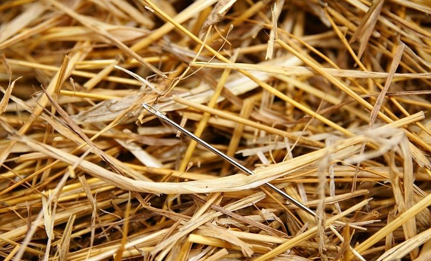

= Finding a needle in a...
:toc: right

NOTE: for this workshop, you need to use repository "git-next-level-workshop-bisect.git" (workshop resources).

== Find the bug !

Open index.html of your repository and click to the button. A bug has been discovered !

Use `git bisect` command to find the commit which has introduced this bug. 

NOTE: You can display help using `git help bisect`

== Find the bug auto-magically :-)

TODO
