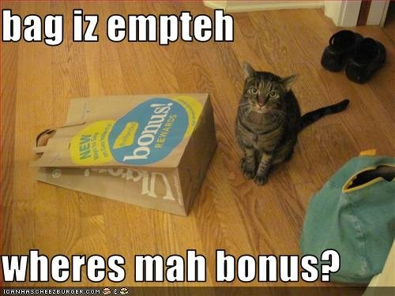

= Bonus
:toc: right

== Bonus Track

IMPORTANT: Do that part only if you finished everything above.

=== Garbage collect all the things

NOTE: Having a GC is very hype those days. Git has one too! Git GC will actually execute automatically under some conditions (too many loose/dangling objects, too many branches/tags...). You generally won't run it manually like in the next part.

* Execute `ls .git && ls -l .git/refs/heads` at your test repository root
* Execute `git gc --aggressive --prune=now`
* See what it changed. Explain the goal of the created file.
