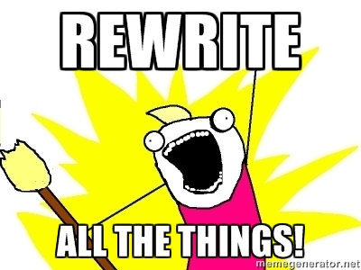

= Twiddling with the history
:source-language: console
:toc: right
:sectnums:

== Rewriting

CAUTION: For this workshop, you need to use repository `git-next-level-workshop-rewriting.git` (workshop resources).

=== Playing with rebase
==== Basics
See <<rebaseInteractiveBasics>> first and along the lab if needed.

==== Let's start

* Open your shell, `cd` to the git workshop repository, list all commits.

CAUTION: Respect the steps order of the following. If you don't, you may change commit SHA-1 and not be able to find the SHA-1 given below.

==== Easy ramp up
* The three last commits ("Add jumbotron (partXXX)") are not consistent separately, merge these commits to create only one (and remove the useless _(partXXX)_ part of the commit log).
** (For reference: first commit SHA-1 shortened version	 = `fc3034f86`)

.Correction
****
* `git rebase -i HEAD~3` to open the editor (most often vi by default) on the last 3 commits
* Replace pick for the first line with _reword_ (or simply _r_)
* Replace pick with **f**ixup on the line 2 and 3
* Quit the editor
* The editor will reopen on the first commit log, modify it to remove the end between parenthesis 
* Quit the editor
* Watch Git work
* Done
****

==== A bit harder
.Situation summary
====

image:../resources/lab-rewriting-hard-part.png[]

Commits `fe9ba27` and `05a2231` are a mess. They contain a dump of modifications without much consistency. Let's fix them!

* Commit `fe9ba27` contains different modifications : 
**  adds a footer ;
*** fixes the header added in the previous commit.
* Commit `05a2231` is a fix of commit `fe9ba27` 
   Merge these two commits to create only one.
   Split this commit to move header correction in the previous commit and keep footer addition in two distinct and consistent commits.
====

==== Smoothy landing
* Commit `dbb8f26` has a spelling error. Fix it.

=== Playing with dangling commit

Execute this command : 
[source]
git checkout fe9ba27

This commit has been modified during previous actions. But you can still check it out.

* How does Git keep track of it?
* Explain why.

=== Playing with "cherry-pick"

The current repository has a branch named "header-black-experiment".
Execute : 
[source]
git checkout header-black-experiment

* List all commits.
* Using cherry-pick command, try to retrieve commit edcdd0a on the master branch
