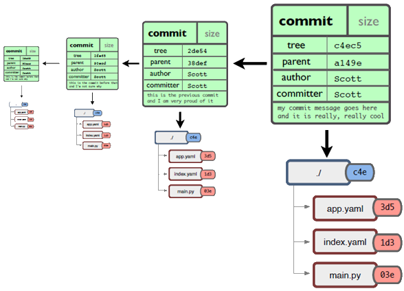
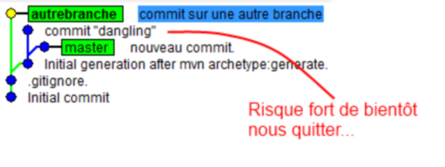

Take your Git practice to the next level
========================================
Baptiste Mathus <batmat@batmat.net>, Michaël Pailloncy <todo@todo.com>
:backend: deckjs
:split:
:deckjs_transition: fade
:deckjs_theme: swiss
:navigation:
:menu:
:deckjsdir: ../.deck.js
:nous: bla bla bla exemple de variable
:source-highlighter: highlightjs
:source-language: console

== About us

TODO: {nous}...

== Agenda

NOTE: This *is* a workshop. So there will be manipulation along the way, don't worry !

* Some History
* The Git Data Model
* Basics concepts & commands reminder
** Merge vs. Rebase
** What's a Fast-Forward?
** The Working Copy, The Index And The Commit
* Rewiewing (and rewriting) changes
* Understanding the .git directory

<<<

* Tips & tricks
////
one lifecycle, if you need to tag a subdirectory, then you need two repos
merge, two root commits if required
filter-branch
////
* Repository lifecycle
** granularity 
** aggregate 
** split 
* EGit & JGit
* Git _workflows_ discussion
** Git flow
** Gerrit

// TODO traduire en anglais

== Some History

* 1900 -> 2002 : Linux development uses tarball

[quote, Linus Torvalds]
For the first 10 years of kernel maintenance, we literally used tarballs and patches, which is a much superior source control management system than CVS is – Linus Torvalds

// @ Michael les chevrons en dessous, c'est quand tu veux 
// le même titre de slide, mais juste changer de contenu

<<<

* 2002 : Transition to BitKeeper

Closed-source DVCS, free licenses provided to OSS.

<<<

* April 2005 : Annoucement of the end of the free license

Triggered by Andrew Tridgell's BitKeeper protocol reverse-engineering

<<<

* 7, April 2005 : First version of Git

[quote, Linus Torvalds]
I'm an egotistical bastard, and I name all my projects after myself. First 'Linux', now 'git'.

== Basics

* **D**VCS
* **De**centralized

* Technically, no server required
* _(Almost)_ everything happens locally
* After a clone, the *whole* project history is present locally and no network access is required to manipulate it

== Fast, Git ?

* Performances, the origins

[quote]
[…] to make that process really efficient. If it takes half a minute to apply a patch and remember the changeset boundary […] then a series of 250 emails […] takes two hours. If one of the patches in the middle doesn't apply, things are bad bad bad.

<<<

* *Content* oriented
* Storing *snapshots*, not diffs

image::ressources/snapshots-vs-delta.png[]
		
// Expliquer ce que sont les hashes - sha1 everywhere :)

== Git Data Model: The 4 Object Types

<<<

blob:: File content, identified by a hash 
image::ressources/object-blob.png[]

<<<

tree:: List of pointers to _blob_, or _tree_, identified by a hash
image::ressources/object-tree.png[]

<<<

commit:: References the (root) tree + metadata, identified by a hash 
image::ressources/object-commit.png[]

<<<

tag:: Name associated with a commit (+ potential metadata)
image::ressources/object-tag.png[]
				
<<<
		

		
== Git commits

* _SHA-1_ hash
* Short version ≥ 4 characters (if non ambiguous)
		
+53b8 = **53b8**9fc7bb117aee396285f9bc6ce913599a6574+
			
<<<

* 1 to n parents
* DAG : _Directed Acyclic Graph_ 

image::ressources/dag-illustration.png[]

[canvas-image="ressources/back-to-basics.png"]
== Back to basics

[role="canvas-caption", position="left-up"]
Back to basics

== Step back

Quiz: what does this?

[source]
----
$ git init pouet && cd pouet
$ git commit -m "initial commit" --allow-empty
$ echo abc > .git/refs/heads/paf
----

<<<

Creates a branch! That's right!

[source]
----
$ git init pouet && cd pouet
$ git commit -m "initial commit" --allow-empty
$ echo abc > .git/refs/heads/paf
$ git branch
* master
  paf
----

image::ressources/applause.gif[]

<<<

So... What are branches again?

== Git branches

* Simple pointer to a given commit
* Git only references _heads_
* Unreferenced commits will be garbaged *eventually*
** _Dangling_ or _detached HEAD_
** created for example each time you rebase

// TODO : Update image above in english...

== Providing a good history to your coworkers

TODO : how to do that, good tool, be able to express what you --did-- think you should have done (rewriting history ftw)

== Merge vs. Rebase

== Fast-Forward?

== The Index

image::ressources/git-staging-area.png[The Index]

add:: adds to the index (-p lets you choose the parts of your file you actually want to add)
index:: staging area (a sweet place to lovingly craft your commits)
commit:: Captures the state of the index.

== Quiz : git add

[source]
.What content has been committed for the _theFile_ file?
----
echo "dingdingdingbabababaaaaa" >> theFile # (1)
git add theFile 
echo "blah" > theFile # (2)
git commit -m "done"
----

== References & useful links

* http://ndpsoftware.com/git-cheatsheet.html
* https://training.github.com/
* Thanks to Scott Chacon's for some of the illustrations reused here