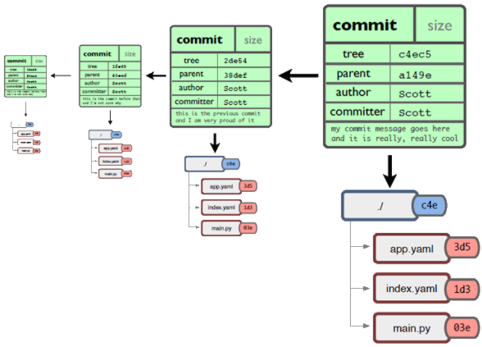
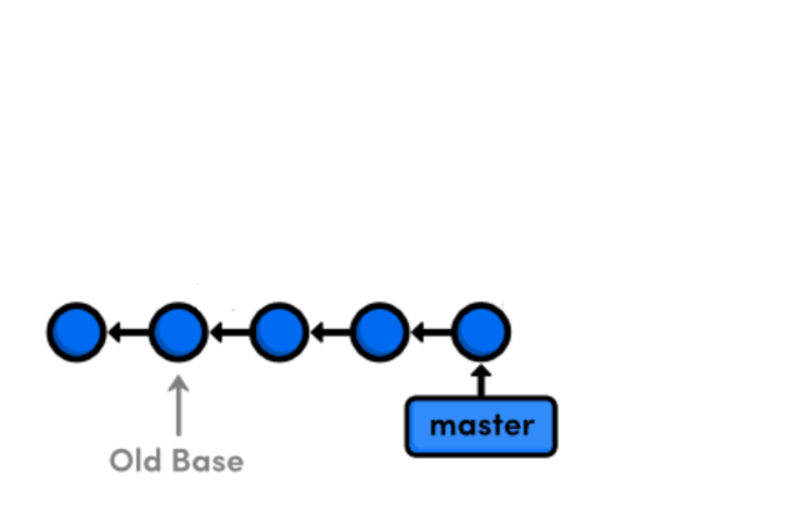
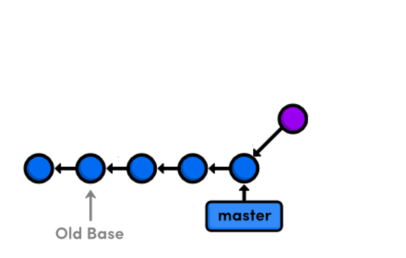

Take your Git practice to the next level
========================================
Baptiste Mathus <batmat@batmat.net>, Michaël Pailloncy <michael.pailloncy@gmail.com>
:backend: deckjs
:split:
:deckjs_transition: fade
:deckjs_theme: swiss
:navigation:
:menu:
:goto:
:status:
:deckjsdir: ../.deck.js
:source-highlighter: highlightjs
:source-language: console
:customcss: resources/custom.css
:customjs: resources/custom.js

:nous: image::resources/lol.gif[]

[role="logo"]
image::resources/prez-logo.png[]

== About us

// TODO !

[cols="^,^"]
|===
a| image::resources/avatar-michael.png[] a| image::resources/avatar-baptiste.png[]
| Michaël Pailloncy | Baptiste Mathus
2+|Working Together @MiPih as ToolSmiths
|===

[role="tags"]
#jenkins #java #maven #nexus #sonarqube #build #docker #passion

== Agenda

_This *is* a workshop. So there will be manipulation along the way, don't worry !_

* Some History
* The Git Data Model
* Understanding the .git directory
* Basic concepts & commands reminder
** Merge vs. Rebase
** What's a Fast-Forward?
** The Working Copy, The Index And The Commit
* Reviewing (and rewriting) changes

<<<

* Tips & tricks
////
one lifecycle, if you need to tag a subdirectory, then you need two repos
merge, two root commits if required
filter-branch
////
* Repository lifecycle
** granularity 
** aggregate 
** split 
* [not-ready]*EGit & JGit*
* Git _workflows_ discussion
** Git flow
** Gerrit

// TODO traduire en anglais

== Some History

* 1991 -> 2002 : Linux development uses tarball

[quote, Linus Torvalds]
For the first 10 years of kernel maintenance, we literally used tarballs and patches, which is a much superior source control management system than CVS is – Linus Torvalds

// @ Michael les chevrons en dessous, c'est quand tu veux 
// le même titre de slide, mais juste changer de contenu

<<<

* 2002 -> April 2005 : Using BitKeeper

Closed-source DVCS. Free licenses provided to the project.

=> Revocation triggered by Andrew Tridgell's BitKeeper protocol reverse-engineering

<<<

* 7, April 2005 : First version of Git

[quote, Linus Torvalds]
I'm an egotistical bastard, and I name all my projects after myself. First 'Linux', now 'git'.

== Basics

* **D**VCS
* **De**centralized

* Technically, no server required
* *Whole* project history present locally
** Only pushing & fetching new commits requires network

== Fast, Git ?

* Performances, the origins

// Early design goal of Git: be quick

[quote]
If it takes half a minute to apply a patch […] then a series of 250 emails […] takes two hours. 

<<<

* *Content* oriented
* Storing *snapshots*, not deltas

image::resources/snapshots-vs-delta.png[]
		
// Expliquer ce que sont les hashes - sha1 everywhere :)

== The Index

image::resources/git-staging-area.png[The Index]

add:: adds to the index (-p lets you choose the parts of your file you actually want to add)
index:: staging area (a sweet place to lovingly craft your commits)
commit:: Captures the state of the index.

== Quiz: git add

[source]
.What content has been committed for the _theFile_ file? (1) or (2)?
----
echo "dingdingdingbabababaaaaa" >> theFile # (1)
git add theFile 
echo "blah" > theFile # (2)
git commit -m "done"
----

[options="step"]
|====
| Right answer: (1) a| image::resources/git-staging-area.png[The Index]
|  (note: difference with svn => (2)) 
a| []  
|====

// Because git add adds the content when called, not only the
// reference to the file like SVN does for example

[canvas-image="resources/dig.jpg"]
== Digging

[role="canvas-caption", position="center-up"]
Let's get a bit deeper now

== Git Data Model: The 4 Object Types

<<<

blob:: File content, identified by a hash 
image::resources/object-blob.png[]

<<<

tree:: List of pointers to _blob_, or _tree_, identified by a hash
image::resources/object-tree.png[]

<<<

commit:: References the (root) tree + metadata, 0 to n parent commits, identified by a hash 
image::resources/object-commit.png[]

[options="step"]
|====
a| Identified by a SHA-1 hash : 
     `53b8` = ``53b8``9fc7bb117aee396285f9bc6ce913599a6574 (short version ≥ 4 chars)
// The author crafted the code, the committer commits it
a| Possibly: Author ≠ Committer 
a| DAG : _Directed Acyclic Graph_ a| image::resources/dag-illustration.png[]
|====

<<<

tag:: Name associated with a commit (+ potential metadata)
image::resources/object-tag.png[]
				
== Git Data Model : wrap up
		

[canvas-image="resources/lab.png"]
== Lab !

[role="canvas-caption", position="left-up"]
Enough talk, link:labs/lab-1-git-directory.html[let's practice a bit]

[role="canvas-caption", position="center-down"]
Understanding the .git directory

[canvas-image="resources/back-to-basics.png"]
== Back to basics

[role="canvas-caption", position="left-up"]
Back to basics

== Step back

Quiz: what does this?

[source]
----
$ git init pouet && cd pouet
$ git commit -m "initial commit" --allow-empty
$ echo abc > .git/refs/heads/paf
----

<<<

Creates a branch! That's right!

[source]
----
$ git init pouet && cd pouet
$ git commit -m "initial commit" --allow-empty
$ echo abc > .git/refs/heads/paf
$ git branch
* master
  paf
----

<<<

So... What are branches again?

== Git branches

* Simple pointer to a given commit (symlink, kind of)
* Git only references _heads_
* Unreferenced commits will be garbaged *eventually*
** _Dangling_ or _detached HEAD_
** Each time you rebase (without *fast-forward*)

////
<<< 

Branching Is Just Working As Expected.

// Early design goal of Git: merging should /just/ work

[quote]
If one of the patches in the middle doesn't apply, things are bad bad bad.
////

== Pointers?

* `HEAD`: shorthand to the latest commit of the current branch
* `HEAD~N`: N commit before the last one 
** (N=1 if omitted)
* `master` (or any branch): automatically bumped when new commit is done on it

image::resources/pointers-HEAD-and-co.png[]

== Resetting

`git reset [--soft|--mixed|--hard] <TARGET>`

* Works on the current branch pointer.

[cols="2"]
|===
a|soft:: keep all local changes
mixed (default):: keep working but reset index
hard:: discard all working copy changes
a| image::resources/git-staging-area.png[The Index]
|===

<<<

Example: 

[source]
git reset HEAD~

* Latest commit becomes the previous one (kind of: HEAD=HEAD~).
* Index is empty
* Working copy is intact

<<<

Example:

[source]
git reset --hard HEAD~2

* HEAD=HEAD~
* Index is empty
* Working copy at the HEAD~2 state (any uncommitted change is lost)

== Merge vs. Rebase

What is it? How to choose one or another?

<<<

What do you want to do?

== Step back, what do you want to actually do?

////
The speaker's goal here is to make audience understand Git (or any other SCM tool) must/should be used (and able) to express something understandable to your coworkers. 
Some SCM tools just doesn't have enough features to express that (CVS, SVN)...
The good thing with Git (i.e. history rewriting) is that it doesn't (and generally isn't) what you actually did, but what seems to you to be the clearer path to make others understand your additions.
Branches are just a way to say "well, it was somehow side/sub-work to the original thing I had to, so I had branched off to make it clear and merged it afterwards (btw, in some situations, that may a good reason to use --no-ff to make that intention stay visible).
////

[quote]
Git lets you express what you did.

<<< 

Correction

[quote]
Git lets you express what you wanted to do.

<<<

Here's what it's all about: 

[quote]
""
Good SCM history reveals intentions. 

Like good code.
""

////
I would definitely argue that that may be the reason why Git is a tool for Software Craftsmen. It gives you the power to do the job right. Hence the bigger complexity than the one with SVN or CVS, btw (far more features).
////

== OK, back to Merge vs. Rebase

What you want to express :

Rebase:: when you don't want your local history to be seen as side/sub-work
Merge:: it was side/sub-work

[canvas-image=resources/git-rebase-illustration-lol.gif]
== Rebase

[role="canvas-caption", position="left-up"]
Git Rebase!

== Rebase

(on feature) git rebase master

<<<

Rewinding:

image::resources/rebase-rewind1.png[]

<<<

Rewinding:

<<<

Replaying:

<<<

Replayed:

image::resources/rebase-replayed2.png[]

<<<

Rebased:

image::resources/rebase-after.png[]

== Merge

(on master) git merge feature

<<<

After (`merge commit` created):

image::resources/merge.png[]

== Fast-Forward -- Remember pointers?

* When possible, Git will *NOT* create _merge-commits_ and just `fast-forward`: bumping the _branch pointer_
* You can prevent it using the `git merge --no-ff` option

// (Note: used by _git flow_ for example)

<<<

image::resources/ff.png[Fast-forward illustration]

[cols="2"]
|===
| Using Merge | Using Rebase
a|
[source,role="console"]
$ git checkout master
$ git merge feature
Updating 38d98a8..d92c9b5
Fast-forward

a|
[source,role="console"]
$ git checkout master
$ git rebase feature
First, rewinding head to replay your work on top of it...
Fast-forwarded master to feature.

|===

== Let's play again

link:labs/lab-2-rewriting.html[Lab!]

image::resources/rewriting.png[]

== Tips & tricks

Git reflog can save your a$$: keeps track of everywhere you went by

Example:

[source]
$ git reflog
f7d3b1 HEAD@{0}: commit (amend): Added reset + compulsory lolcat
440a3bf HEAD@{1}: commit (amend): Added reset + details
c830885 HEAD@{2}: commit: Ajout reset
36b4dce HEAD@{3}: commit: Passe sur les ajustements: ff, intro...
5ef0aa8 HEAD@{4}: commit (amend): On sa mis dacor
8e51635 HEAD@{5}: rebase -i (finish): returning to refs/heads/master
8e51635 HEAD@{6}: rebase -i (fixup): On s'a mis dacor
b6d8c99 HEAD@{7}: rebase -i (pick): On s'a mis dacor

<<<

What if you know you introduced a bug between one commit and another?

But there's 1000 commits between them?

How to find out the offending one?

[options="step"]
* Git bisect: search bug by dichotomy (_binary search_)!

== Repository lifecycle & manipulations

////
one lifecycle, if you need to tag a subdirectory, then you need two repos
merge, two root commits if required
filter-branch
////

<<<

*Granularity*

One repository, one lifecycle.

* One version number
* If many _parts_, everything released each time

<<<

*How to aggregate many repositories afterwards?* Just merge!

[source]
----
git init repo1 && cd repo1 && git commit -m "Initial 1" --allow-empty && cd ..
git init repo2 && cd repo2 && git commit -m "Initial 2" --allow-empty
git remote add other file://$PWD/../repo1
git fetch other
git merge other/master -m "let's merge them"
----

[source]
git log --oneline --graph
*   c2be901 let's merge them
|\  
| * 1763514 Initial 1
* 8208b0a Initial 2

<<<

*How to explode one repository into multiple ones, remove some file from all commits...*

*filter-branch* is your friend.

link:labs/lab-3-bisect-and-filter-branch.html[Let's play with those!]

////
== EGit & JGit

[role="todo"]
Probablement à supprimer en tant que tel, ou en tout cas à injecter au fur et à mesure.
Mettre un bout de code JGit en exemple ?

== Git _workflows_ discussion

* Git flow
* Gerrit

////

////
TODO : slide de conclusion
////

== References & useful links

* http://ndpsoftware.com/git-cheatsheet.html
* https://training.github.com/
* Great tool for learning & understanding Git: http://pcottle.github.io/learnGitBranching/
* link:http://schacon.github.io/git/gitrepository-layout.html[Repository layout]
* Special thanks to Scott Chacon for many illustrations reused here

