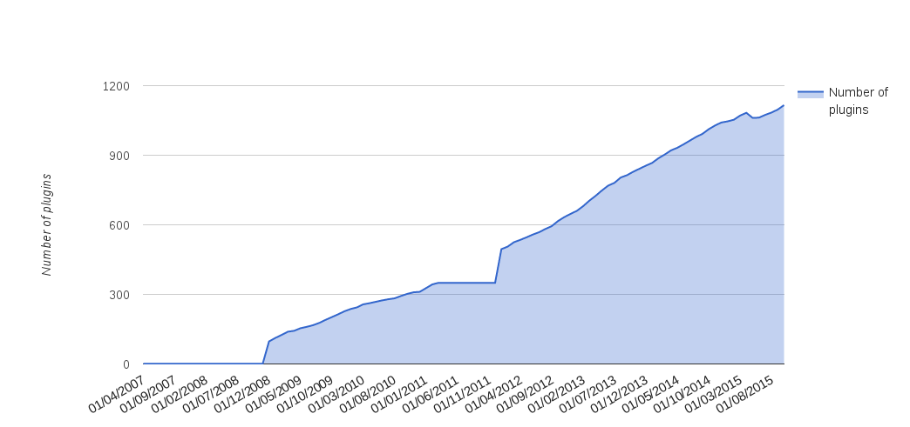
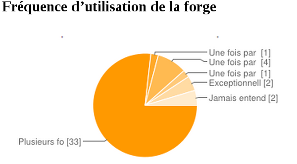
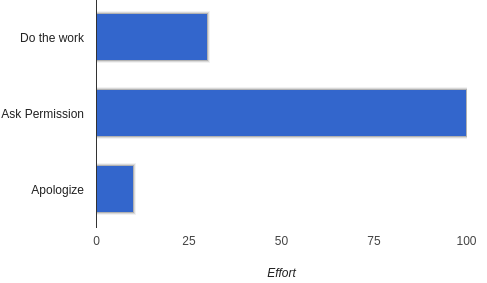
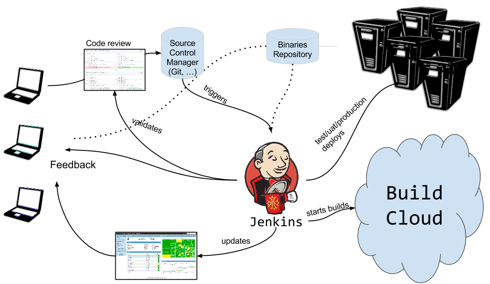
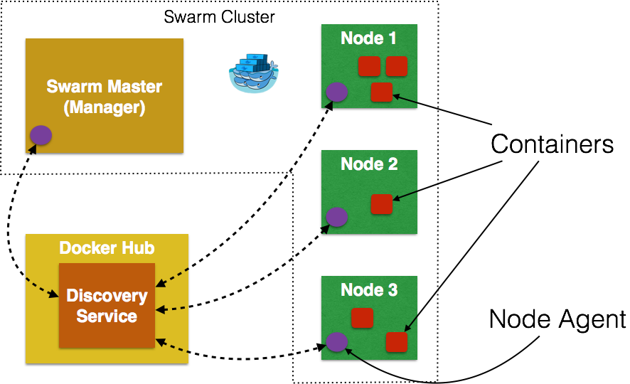

= Jenkins aux amphét'
Baptiste Mathus <@bmathus>
:backend: deckjs
:split:
:deckjs_transition: fade
:deckjs_theme: swiss
:navigation:
:menu:
:goto:
:status:
:deckjsdir: ../.deck.js
:source-highlighter: highlightjs
:source-language: console
:customcss: resources/custom.css
:customjs: resources/custom.js
:deviconimgsize: 54

== A propos de moi

[source]
def BaptisteMathus =
       people.filter(p -> p.isHacker())
             .filter(p -> p.isOpenSourceFan())
             .filter(p -> p.isCommitterOn("Jenkins"))
             .filter(p -> p.isCommitterOn("MojoHaus"))
             .filter(p -> p.strivesToBeDeveloperCatalyst())
             .filter(p -> p.isShadowITSpecialist())
             .uniqueResult()

image::resources/batmat-about.png[width=500]

[role="tags"]
#jenkins #java #docker #maven #automation #devops #nexus #sonarqube #passion

== Au programme

[.lead]
Arrêter les croneries

<<<

[.lead]
* Papi, raconte-nous comment tout ça est arrivé !

[.lead]
* Trucs & astuces de gestion de cluster Jenkins

[.lead]
* Aujourd'hui et demain

[canvas-image="resources/back-to-future.jpg"]
== Retour aux sources

[role="canvas-caption", position="left-up"]
On rembobine

<<<

[.lead]
2007 : Apache Continuum -- nos débuts dans l'Intégration Continue

* quelques _jobs_
* 1 machine AIX
* gestion "en plus"
* pour 10 à 30 personnes

<<<

[.lead]
2009 : passage à Hudson, parce que...

[quote, Alan Kay]
Simple things should be simple, complex things should be possible.

[.lead]
2009 : Sonar, Inspection Continue - Qualité du code.

<<<

[.lead]
2011 : Oracle forke la communauté Hudson, nous restons sur Jenkins

image::resources/jenkins_rugby.png[width=350,scaledwidth="50%",center,alt="Jenkins Toulousaing!"]

<<<

(Au fait : pour ceux qui penseraient encore qu'Hudson est en concurrence avec Jenkins)

<<<

[.lead]
Fast-Forward : 2015

* *1000* jobs
* *50 heures* de build par jour en moyenne
* *20* noeuds Red Hat, AIX, Windows...
* *1, puis 2* personnes à plein temps
* *20 millions* de lignes de logs / semaine
* pour environ 100 à 200 personnes*

////
Environ, selon si on compte développeurs uniquement, accès à Jenkins ou à l'ensemble
des outils, etc. A la limite les commerciaux qui téléchargent depuis Nexus, plus ou moins directement.

Exemple : logs d'accès uniquement à Jenkins seulement pour le 24/11, donc a priori plutôt des profils
liés au développement, le nombre d'IP
$ zcat ic-access.log-20151124.gz | awk '{print $1}' | sort -u | wc -l
55
////

== Suivi de l'état des jobs d'une équipe

[.lead]
Avant : jobs globalement suivis, mais pouvaient rester _rouge_ pendant longtemps.

[.lead]
Pas toujours jugé important.

<<<

[.lead]
Introduire des _Radiateurs d'Information_ ?

<<<

[.lead]
Au début... Accueil mitigé...

////
Au début, rejet pour différentes raisons : sensation de flicage, écologie
////

<<<

[.lead]
Aujourd'hui

image::resources/radiators/radiators-ok.png[role="middle stretch-y"]

////
Montrer l'exemple en mettant ses propres jobs dans son propre radiateur

écologie : l'ordi est configuré dans le Bios pour s'éteindre le soir.
Le premier qui arrive l'allume. C'est tjs un ordi/écran allumé, mais au moins
il ne l'est plus 24h/24 7j/7
////

== Mais comment ?

image::resources/boss-vs-leader.png[width="95%"]

////
Sans prétention. Certaines équipes ont juste fait ce qu'elles voulaient, et ça a essaimé.
Marche infiniment mieux que de tenter de synchroniser tout le monde en amont, via des réunions stériles, etc.

////

== Code Review

[.lead]
Avant : un peu outillé, mais pas trop. Processus _daté_

<<<

[.lead]
Aujourd'hui :

* Jobs Sonar dans les walls
* Gerrit : revue automatique des nouveaux commits (en "cours" de généralisation)

image::resources/gerrit-review.png[]

== Vraiment utile ? Et ça plaît ?

<<<

[quote,Entendu au café]
Franchement, si je devais rebosser dans une boîte où
ya pas d'IC, pas d'automatisation, ce serait... Déprimant !

image::resources/depressing.gif[]

<<<
Sondages fin 2014 :

image::resources/sondage-frequence-satisfaction.png[]

////
Les développeurs ont vraiment pris le contrôle. Ils ont presque tous le réflexe pour les trucs
répétitifs et/ou risqués d'écrire un job.
////
<<<

[.lead]
Sans ces outils, pas d'Agilité.

[.lead]
Repasser tous les tests de non-régression à la main toutes les 2 semaines ?

image::resources/lolcat.jpg[LOL]

<<<

[quote, The speed paradox – fast delivery also gives superb quality]
Deliver as fast as possible

== Lean Software Development

. _Éliminer les gaspillages_
. Améliorer l'apprentissage
. Retarder l'engagement
. *Livrer aussi vite que possible*
. *Donner le pouvoir à l'équipe*
. *Intégrer la qualité dès la conception*
. Considérer le produit dans sa globalité

////
Au final, sans le savoir, nous sommes passés par certaines étapes déconseillées par
le LSD, avant d'arriver parfois à l'évidence...
Donc bien mieux ancré/compris l'importance de la chose.
On comprend et retient mieux quand a soi-même fait une erreur pourquoi et comment ne pas la reproduire...
////

== Donnez le pouvoir - soyez DevOps !

////
DevOps, né de l'Agilité de toute façon, désigne une façon d'être : que les gens soient intéressés
par tout ce qui concerne leur appli :
depuis sa conception, jusqu'à la prod, la discussion et le support des clients, etc.

Mais c'est aussi, et peut-être surtout, de l'empathie et de l'humanisme : faire confiance, se mettre
à la place des équipes qui ne nous donnent pas toujours ce qu'on veut, essayer de leur parler, de changer
les choses, etc.

Pour caricaturer, les luttes éventuelles de pouvoir internes de l'entreprise n'ont pas grande importance
face à l'exigence de satisfaire les clients. Si vous en avez, outrepassez les frontières...
////

[.lead]
Pourquoi ?

<<<

[.lead]
Comme le management, l'outillage doit être un soutien, un catalyseur, pas un frein ! +
Faire confiance. Accompagner au lieu de contrôler.

<<<

[.lead]
Accompagner les utilisateurs/dévelopeurs vers l'autonomie

[.lead]
Fournir des produits *facultatifs* permettant d'accélérer, plutôt que de faire pour l'équipe.

////
Faire ateliers sur ateliers, seul moyen de former un maximum de gens.
C'est l'histoire classique "donne à quelqu'un un poisson, il mangera une fois,
apprends lui à pécher, et il n'aura plus jamais faim"....
////

<<<

Vous connaissez Netflix ?

[quote, a Fortune 100 CTO to Adrian Cockroft (Directeur chez Netflix)]
Netflix has a superstar development team, we don’t!

[quote, Adrian Cockroft, 'http://readwrite.com/2014/10/06/developers-care-feeding-cloud-open-source']
Netflix hired them from you, and got out of their way.

////
Par ailleurs, Netflix est connue pour être l'une des entreprises qui ont initié et montré que
Devops pouvait apporter de grandes perfs à la boîte.

Agile without Devops Is A Local Optimization!
////

== (Prenez le pouvoir)

[quote]
Il est plus facile de demander pardon que de demander l'autorisation !

== Autres intérêts d'une forge

[.lead]
Excellent laboratoire pour tester de nouvelles choses dans des conditions exigeantes,
sans pour autant être directement face au client.

[canvas-image="resources/cats-drilldown.jpg"]
== Deeper

[role="canvas-caption", position="left-up"]
OK, passons à la technique maintenant !

== Architecture typique d'une forge

Courante :

image::resources/forge-simple.png[]

<<<

Intermédiaire :

image::resources/forge-intermediate.png[]

<<<

Avancée

== Revue de code

* Gerrit,
  intégration Jenkins via le link:https://wiki.jenkins-ci.org/display/JENKINS/Gerrit+Trigger[Gerrit Trigger Plugin]
* GitHub Pull-Requests,
  intégration Jenkins via le link:https://wiki.jenkins-ci.org/display/JENKINS/GitHub+pull+request+builder+plugin[GitHub pull request builder plugin]

== Versionner ses jobs

Gêné par le fait que les jobs configurés dans l'IHM ne soient pas identiques, pas versionnés, etc. ?

Utilisation d'une syntaxe déclarative pour décrire ses jobs

[source,groovy]
.Exemple : Génération de 11 jobs sur le même modèle en une simple boucle
----
def giturl = 'https://github.com/quidryan/aws-sdk-test.git'
for(i in 0..10) {
    job("DSL-Tutorial-1-Test-${i}") {
        scm {
            git(giturl)
        }
        steps {
            maven("test -Dtest.suite=${i}")
        }
    }
}
----

== Décrire un processus de déploiement complexe

Depuis 2014, nouveau plugin `Workflow`. On peut décrire le processus que l'on souhaite via un `Domain Specific Language`

Facilitation du `Continuous Delivery` dans Jenkins

// Exemple simpliste

[source,groovy]
----
node('remote') {
  input 'Ready to go?'
  def mvnHome = tool 'M3'
  sh "${mvnHome}/bin/mvn -B -Dmaven.test.failure.ignore verify"
}
----

== Jenkins : conseils et astuces

* Ne jamais affecter un job à un noeud, toujours à un label

<<<

* Utiliser Jenkins pour installer automatiquement les outils (Maven, JDK...)

<<<

* Utiliser _Docker_ pour définir un environnement précis pour une `step` d'un job
  (exemple : telle étape *doit* se dérouler sur une `Fedora` : très simple avec `Docker`)

<<<

* les `System Groovy Script`

Très pratique pour faire des choses par lot (renommages en masse, etc.)

Alternatives : jenkins CLI, API REST...

[source,Groovy]
.Script qui cherche les builds dont l'ancienneté est plus faible que la valeur indiquée, puis calcule le temps d'exécution total de tous les builds identifiés.
----
def numberOfHoursBack = 7*24

def totalBuildTime =
  Jenkins.instance.getItems(Job.class).collect { job ->
    job.getBuilds().byTimestamp(
                System.currentTimeMillis()-numberOfHoursBack*60*60*1000,
                System.currentTimeMillis()
    )
  }
  .flatten()
  .collect { build -> build.getDuration() }
  .sum()

def totalBuildTimeInMinutes = (int)totalBuildTime/(60*1000)

println "During the last $numberOfHoursBack hours"
println "\t $totalBuildTimeInMinutes minutes total"
println "\t ${totalBuildTimeInMinutes/numberOfHoursBack} minutes per hour in average"
----

Affiche :

[source,shell]
----
During the last 168 hours
	 22490 minutes total
	 133.8690476190 minutes per hour in average
----

== La gestion des noeuds de build

* Avant : VM statique(s)
* Aujourd'hui : cluster Docker Swarm - autoscaling extrêmement simple

== Docker en un slide ?

Pour simplifier : VM allégée, qui démarre en quelques millisecondes

image::resources/docker-short.png[]

== Création d'un cluster swarm via Docker Machine

[source]
.Création d'un cluster de 100 machines !
----
$ TOKEN=$(docker run --rm swarm create)
$ DIGITALOCEAN_SIZE=64gb
$ docker-machine create \
            --driver digitalocean --digitalocean-access-token=... \
            --swarm --swarm-master --swarm-strategy "binpack" \
            --swarm-discovery token://$TOKEN \
            swarm-master

$ for nodeNumber in $(seq -w 1 100)
  do
    docker-machine create \
            --driver digitalocean --digitalocean-access-token=... \
            --swarm --swarm-discovery token://$TOKEN \
            swarm-node-$nodeNumber
  done
----

C'est prêt, on peut lancer quelques _builds_ via le plugin _Docker_ de Jenkins ! :-)

== Démo !

[.lead]
Préambule : archi Docker Swarm

link:http://blog.arungupta.me/clustering-docker-swarm-techtip85/[Image credit]

<<<

image::resources/demo-3.gif[]

== Docker Swarm + Jenkins Docker Plugin

* Docker in Docker : attention aux bind mount en mode sibling (link:https://jpetazzo.github.io/2015/09/03/do-not-use-docker-in-docker-for-ci/[recommandé])!

Oubliez

[source,shell, wrong]
docker run -v a:b someimage

////
-v va tenter de mapper le FS du conteneur, mais cela ne marchera pas parce que c'est en fait le FS
du host qui va être (mal, donc) mappé.
////

<<<

* Container leak
** Problème : Swarm finira par refuser de démarrer de nouveaux conteneurs !

////
Le Docker plugin "perd" régulièrement des esclaves. Pb : même éteint, un conteneur présent
réserve la mémoire associée. Cette /fuite/ peut donc plus ou moins rapidement conduire
à ce que swarm n'accepte plus aucun `docker run`.
////

<<<

* link:https://gist.github.com/batmat/e67e661656c3d31ed36f[Remplissage cluster : monitoring]

== Conclusion

[quote]
Consacrer le temps humain à ce que les machines ne savent pas faire.

<<<

[quote]
Aujourd'hui, avec le cloud, il est devenu beaucoup plus facile de monter une infrastructure intéressante pour la CI.

<<<

[.lead]
Investir dans l'outillage : c'est pouvoir aller plus vite, garder ou attirer les bonnes personnes dans votre entreprise !
