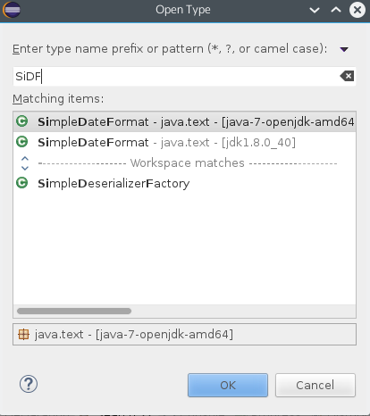

== Find any class by name

[role="shortcut tip"]
Control-Shift-T

== Find resources

[role="shortcut tip"]
Control-Shift-R

== Use CamelCase

image::camelcase-filtering.png[]

<<<

Or more selectively

