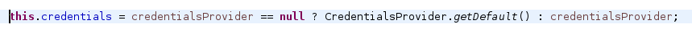
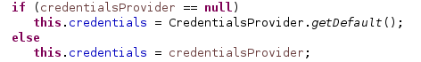

== Extract Method

Select text, right click and extract the whole code block into a new method easily.

== Inline Method

Contrary to the precedent, easily inline the code of a method.

* Select method to inline/Right click/Refactor/Inline Method.
* Shortcut: Alt-Shift-I

== Refactoring: Replacing ternary with if/else

Sometimes (well, more often than not, I'd argue), you should replace your ternary expression with an if[/else]

Before :

After :

