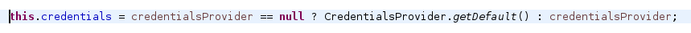

== Find any class by name

[role="shortcut tip"]
Control-Shift-T

== Browse current class methods

Ctrl-O displays all the methods of the current class

<<< 

Or Inherited

Ctrl-O-O methods of the current class + *parent*

== Find resources

[role="shortcut tip"]
Control-Shift-R

== Use CamelCase

image::camelcase-filtering.png[]

<<<

Or more selectively

image::camelcase-filtering-more-selective.png[]

Use space or < to stop matching

== Move/Copy lines up and down

:selectedtextdown: the currently selected lines down

* Alt-arrow-down to move {selectedtextdown}
* Ctrl-Alt-arrow-down to copy {selectedtextdown}

== Quick contextual execution menu

_Alt-Shift-x_ will display a contextual menu.

Example: you're in a JUnit class, just type Alt-Shift-X then T to run the tests.

image::alt-shift-x-menu.png[]

== Execute previous run instead of current open file

Be explicit. Changing the code it's natural to just run Ctrl-F11 or F11 to re-execute the previously ran test

Run/Debug/Launching/Launch Operation/Always launch the previously launched application

[[QuickFix]]
== Quick fix

Type _Ctrl-Shift-1_ to see what the possible actions are on the current focus

== Extract Method

Select text, right click and extract the whole code block into a new method easily.

== Inline Method

Contrary to the previous one, easily inline the code of a method.

* Select method to inline/Right click/Refactor/Inline Method.
* Shortcut: Alt-Shift-I

== Refactoring: Replacing ternary with if/else

Sometimes (well, more often than not, I'd argue), you should replace your ternary expression with an if[/else]

Before :

After :

image::ternary-after.png[]

== Invert if/else conditions

Select the if/else to invert, and call the Quick Fix

== Generate for-loop on collection

Just type the collection/array, and call the Quick Fix

// TODO add link to quickFix

== Typing: automatically place semicolons

== Typing: escape text when pasting into a string literal

Not enabled by default. In Java/Editor/Typing.

== Meta-Shortcut

Use _Ctrl-Shift-3_ on a selected item, then start typing to filter the possible actions in the _Quick access_ menu.

TODO : Slide #24 : meta shortcut avec extract constant n'a pas marché => trouver un exemple concret qui fonctionne

[formatterOnOff]
== Formatter: don't touch that part (using begin/end tags)

[source,java]
----
// @formatter:off
     // Some weirdly formatted source
     String s2 = 
				            "hello";
// @formatter:on
----

[thanks]
link:https://groups.google.com/d/msg/toulouse-jug/EFHt84uEkLk/-OoFV7dopNQJ[Thx Emmanuel Fontan]

== How to quick fix many issues outside of the Clean up menu

Many quick fixes are actually available, but not always through cleanup

TODO : part that went bad. Prepare a real demo use case.
Suppression massive de variables non utilisées n'a pas fonctionné avec (String a ="" pas pris en compte)

////
[quote]
In Luna (4.4), the multi-fix in the whole file works via Quick Fix hover or via Ctrl+1 popup and then using Ctrl+Enter. To apply the fix to a whole project, you can:
- select the problem in the Problems view
- select the whole project so that the Problems view shows problems from all selected resources
- activate the Problems view again and use Ctrl+1 or context menu > Quick Fix
- select the right fix, click Select All, and click Finish
////

https://bugs.eclipse.org/bugs/show_bug.cgi?id=351956

== Junit: add -ea to VM arguments..

Good way to enable this option but not globally when you may be using libs that added a bunch of incorrect assertions

== Favorites

static imports for autocompletion

== JSR305 annotations to help null analysis

TODO : add dependency to project + prepare sentences to present it in a few seconds

<<<

Annotate the package itself to define the default value for a whole package

=> `package-info.java`

== JSR 305 externally defined annotations

link:https://www.eclipse.org/eclipse/news/4.5/M6/#JDT[JSR305 externally annotated classes (Eclipse Mars)]
https://bugs.eclipse.org/bugs/show_bug.cgi?id=461300

TODO !

== Save actions: automatic formating

== Overwrite end of method name instead of adding

Java/Editor/Content Assist : toggle "Completion overwrites" instead of "Completion Inserts"

== Automatic contextualization inside an instanceof block (auto-add cast)

== Type filters

In Java/Appearance/Type Filters

To filter out java.awt.* for example...

<<<

filter out method coming from Object! (who wants to call notify...)

== Filtering methods by categorizing them

Categorize Filtering/choosing which methods to display in the _Outline_ using javadoc's _@category_ tags 

[thanks]
(thanks link:https://groups.google.com/d/msg/toulouse-jug/EFHt84uEkLk/Wdf3VMMDM0YJ[Jordi Barrère]).

== _Exception variable name in catch blocks_

== Multi-line Edit

Alt-Shift-A or the icon, as if Sublime Text invented it all ;-)

[thanks]
(link:https://groups.google.com/d/msg/toulouse-jug/SpOWtYPxJa0/tGkr5LAbwU8J[thx Olivier Jaquemet])

== Logical structure

Present complex/weird data structure in a more logical that physical way

see:  link:http://help.eclipse.org/luna/index.jsp?topic=%2Forg.eclipse.jdt.doc.user%2Freference%2Fpreferences%2Fjava%2Fdebug%2Fref-logical_structures.htm[here] 

and link:http://www.javalobby.org/java/forums/t16736.html[here] at least.

TODO Ajouter exemple concret pour Logical Structure

== Abreviate package name

Java/Appearance

== Working Sets

== Scrapbooking, REPL

[source,java]
String s = String.format("%05d", 7);
s

https://recoveringprogrammer.wordpress.com/2013/04/06/using-eclipse-scrapbook-to-quickly-test-your-code/

TODO : Faire sécher tips avec jpage, trouver un exemple concret 

== Add to snippets

TODO : réviser comment ça marche !

== Extensions: SnipMatch

Example: formatter on/off (cf. <<formatterOnOff>>)

TODO : vérifier fonctionnement et besoin rezo ?

== Breakpointing

* conditional
* exception
* class load!

== Conditional breakpoints

Many conditions, not always well-known

<<<

Use it to debug : 

[source,java]
System.out.println("HERE WE ARE: "+theVariable);
return false;

== Clean Up in general

== Clean Up: Convert to lambda expression

== Code templates

Cf. Java/Editor/Templates

== Package name abbreviations

Package names in Java views can be abbreviated with custom rules. For example, the following rules produce the rendering shown below:

	org.eclipse.ui={UI}
	org.eclipse.ui.texteditor={T}
	org.eclipse.ui.internal.texteditor=[iT]

